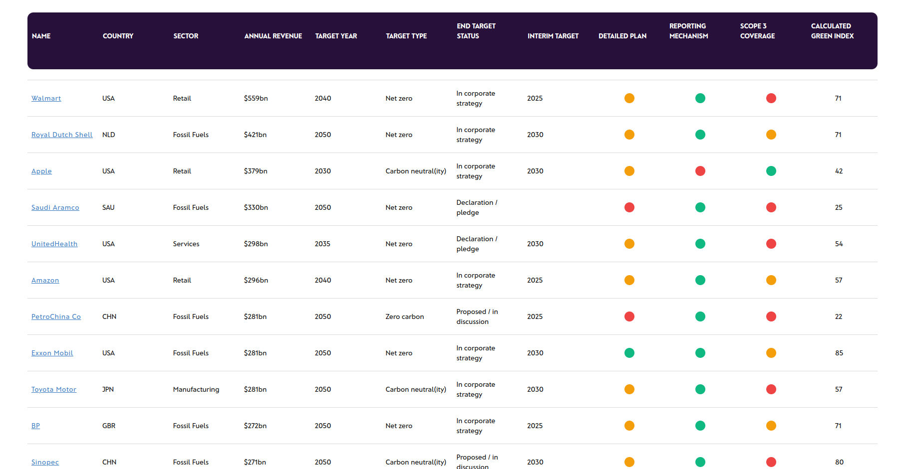

# Environ.Earth

- A website that focuses on identifying companies with a "net zero" target and analyzing their key components to determine their "GREEN INDEX".
- We have also created an interactive map that displays the GREEN INDEX of different countries and provided an API to access the data.


[](https://environ-earth.onrender.com/) 

Home Page


Green Index Table



API Documentation


## Installation

Clone the repo

```bash
git clone https://github.com/kanhaiya04/Environ.earth.git
cd Environ.earth/
```

Use the package manager to install dependencies.

```bash
npm install
```

## Run on local server

To start the server
```bash
node app
```
